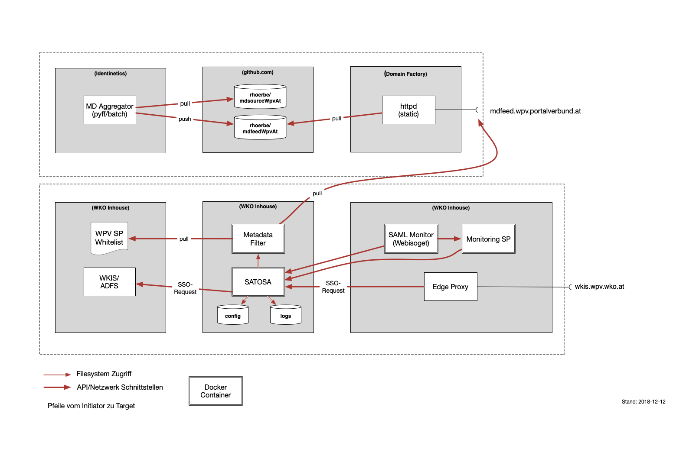

:toc:
= Deployment Dokumentation für den WKIS WPV-Gatway

== Übersicht

Der WKIS-WPV Gateway besteht aus mehreren Docker Images.

=== CI-Prozess und Schnittstellen

Die Schnittstelle zwischen Entwicklung und Betrieb sind öffentliche Github Repositories,
in denen Sourcen und Buildscripts enthalten sind.
Für die Konfiguration werden Templates in privaten Github-Repos bereitsgestellt.

Die Container werden mit Docker-Compose verwaltet.
Die compose-config Dateien werden als Default mitgeliefert.

Die Docker Images werden über Jenkins Jobs erzeugt und optional in ein Docker Repository hochgeladen.
Im jeweiligen Git Repo gibt es dafür ein Jenkinsfile.
In der Zielumgebung werden die Images vom Docker Repo geladen und ausgeführt.

=== Komponenten und Deployment Artefakte

.Deployment Artefakte
[cols="2,1,8,3"]
|===
|Repo | Build | Beschreibung | Abhängigkeiten
|https://github.com/rhoerbe/c-wkis-proxy[c-wkis-proxy] | - | SATOSA Config Template Repo  |
|https://github.com/identinetics/d-satosa[d-satosa]| X | Satosa Docker Image Builder | SATOSA, dcshell
|https://github.com/identitypython/SATOSA[SATOSA] | - | SATOSA SAML/OIDC Proxy |
|https://github.com/identinetics/d-rpmgr[d-rpmgr] | X |  Relying Party Manager| -> https://github.com/identinetics/pyFF[identinetics/pyFF], https://github.com/rhoerbe/pyXMLSecurity[rhoerbe/pyXMLSecurity]
|https://github.com/identinetics/webisoget[webisoget] | X |  SAML-Monitor Webisoget (Docker Image Builder) |
|https://github.com/rhoerbe/c-webisoget[c-webisoget] | - | Webisoget config Template Repo|
|https://github.com/identinetics/c-shibsp-mon[c-shibsp-mon] | X |  Monitoring SP Docker Image Builder |
|https://github.com/identinetics/[dcshell] | - | Docker-compose tools |
|https://wiki.wpv.test.portalverbund.gv.at[wiki] | - | Online-Dokumentation WPV|
|===

Installation und Konfiguration sind im README des jeweiligen Repos enthalten.

.Deployment Übersicht

=== Staging Umgebungen

Eine klare Trennung der Staging-Zonen ist nicht immer wünscheswert,
daher muss im Einzelfall entscheiden werden wo welche Komponente eingebunden wird.
Das Standardschema ist:

[cols="<,^,^,^"]
|===
| | Entw. | QS | Prod
| Metadatenfeed mdfeed.test.wpv.portalverbund.at| x | x |
| Metadatenfeed mdfeed.wpv.portalverbund.at/metadata.xml| | | x
| wkis.dev.wko.at | x |  |
| wkis.play.wko.at | x |  |
| wkis.qss.wko.at | x | x |
| wkis.wko.at |  |  | x
| Monitoring IDP (idp2.test.wpv.portalverbund.at)| x | x | x
| Monitoring SP (testsp.wpv.portalverbund.at)| | | x
| Anwendung mit Spieldaten Einbindungstest | x | |
| Anwendung mit Echtdaten Einbindungstest | | x |
| Anwendung produktiv | | | x
|===

=== Versionierung

Docker Images werden mit Build-Nummern getaggt.
Die Buildnummer hat das Format Bn.m, wobei n die globale Nummer im Source Repo und m die lokale am Build-Server ist.
Sie können über diese Tags den Staging-Zonen zugeordnet werden.
Welche Source Version jeweils verwendet wird muss vom Betreiber entschieden werden.

Z.B. könnte eine Image Liste wie folgt aussehen:

REPOSITORY            TAG                 IMAGE ID            CREATED             SIZE
r2h2/shibsp           B8.1                62726aee1a4e        3 weeks ago         714MB
r2h2/shibsp           latest              62726aee1a4e        3 weeks ago         714MB
r2h2/pyff             B7.5                bd4fb3c5de90        3 weeks ago         1.1GB
r2h2/pyff             latest              bd4fb3c5de90        3 weeks ago         1.1GB
r2h2/shibsp           B7.7                6388f9eeb9cc        4 weeks ago         714MB
postgres              11                  4dcf1ba7e5e2        3 months ago        312MB
r2h2/shibsp           B5.4                ad47b59835b1        3 months ago        708MB
r2h2/pyff             B6.1                f838e34df5a5        7 months ago        1.14GB

Die einfachste Möglichkeit die Image-Version einer Zone zuzuordnen ist den services.service.image Key im docker.compose.yaml entspreched zu setzen.

Die Buildnummer reflektiert die Änderungen von Source und Abhängigkeiten.
Siehe https://github.com/identinetics/dcshell/blob/master/docs/Buildnumbers.adoc [Buildnumbers].

Als Ergebnis eines Builds wird das Image mit den Tags :Bn.m und :latest erzeugt.
Images mit älteren Build#-Tags werden am Build-Server automatisch gelöscht.
Am Zielserver sind sie manuell zu verwalten.

Der Start eines Containers erfolgt mit dem im docker-compose File konfigurierten Tag.
Die Freigabe eines Image für eine Staging-Zone erfolgt, indem der Container gelöscht und neu erstellt wird.
(docker-compose doown und up).

=== Installation

Die Images werden über Jenkins gebaut in ein Repository gepusht.
Die Pipeline für Build etc. ist im jeweiligen Repo unter Jenkinsfile zu finden.

Das Ziel des Deployments ist einen Gateway zu betreiben, der WKIS mit dem SAML-Profil des WPV verbindet.
Der Gateway besteht aus:

- SATOSA (SAML to SAML Porxy)
- RP Manager (Eine Webapp für die Verwaltung der Relying Parties)
- SAML Monitor

== Deployment
=== Systemvoraussetzungen für den Docker Host

- RH-Docker oder Docker Community Edition >= 18.09.0
- Docker Compose >= 1.18
- git

=== Parallelbetrieb von Containern auf der gleichen VM

QS und Prod-Instanzen können auf der gleichen VM betrieben werden.
Folgende Unterschiede sind in der Konfiguration zu beachten:

|===
| Datei | Variable | Wert QS | Wert Prod
| docker-compose.yaml | service | satosa-qs | satosa
| docker-compose.yaml | container_name | 05satosa | 06satosa
| docker-compose.yaml | hostname | 05satosa | 06satosa
| docker-compose.yaml | volumes | 05... | 06...
| httpd.conf | Liste | 8001 |  8000
| vhost.conf | VirtualHost | *:8001 |  *.8000
|===

Achtung! docker-compose schreibt die Warnung "Found orphan containers (..satosa) for this project",
wenn die Image Tags auf das gleiche Image verweisen.
Diese Warnung ist zu ignorieren. (Man könnte auch separate Projeke definieren, siehe --project.)

=== Build Prozess

==== Jenkins einrichten

Die Quelle für CI-Pipeline ist das Jenkinsfile im jeweiligen Source-Repository (siehe Liste der Artefakte).
Es enthält die Konfiguration und das Jenkinsfile für den Build-Prozess.
Das Template für das (private) Repo ist https://github.com/rhoerbe/c-wkis-proxy.
Das Repo liegt auf github.com/identinetics und ist nur für autorisierte Benutzer erreichbar.
Für den Build-Server wird ein eigener Deploy Key eingerichtet:

    ssh-keygen -t ed25519 -f  ~/.ssh/id_ed25519_c-wikis-proxy

Der zugehörige Eintrag in ~/.ssh/config sieht dann wie folgt aus (Hostname ist per Konvention der Repo-Name):

    Host c-wkis-proxy
        Hostname github.com
        IdentityFile ~/.ssh/id_ed25519_c-wikis-proxy
        User git

Laden:

    cd /opt/c-wkis-proxy  
    git clone c-wkis-proxy:rhoerbe/c-wkis-proxy

==== Build/Deploy Image

Docker Images werden mit einem Jenkins Server erstellt und auf einem Docker Repo abgelegt.
Die jeweilige Versionsnummer wird im Image Tag geführt.
Der Administrator der Zielmaschine holt aktuelle Images und konfiguriert welche Version einzusetzen ist.

Für den Build-Prozess ist ein Jenkins Pipeline Job zu definieren.
Die Pipeline ist (Jenkinsfile) ist  im jeweiligen Repository enthalten.
In der Job-Definition ist zu beachten, dass Subrepositories geladen werden.
(-> Advanced Submodule Behaviors | 	Recursively update submodules)

Das lokale Docker Repository kann am einfachsten mit der Standard Docker Registry eingerichtet werden.
Um Images am Zielsystem zu laden wird das jeweilige Image mit `docker pull` geholt.
Alternativ können Docker Images mit `docker image save` am jenkins-Server in ein tar Archiv kopiert
und am Zielserver mit `docker image load` geladen werden.

Jeder Veränderung im Source Repository oder den Abhängigkeiten erzeugt eine höhere Build Nummer, die im Docker Image Tag enthalten ist.
(Nicht im RP-Manager).

=== Docker Image am Zielsystem verfügbar machen

Das Docker Image kann von Dockerhub geladen oder lokal gebaut werden. 
Das entsprechende Quelle ist in docker-compose.yaml zu konfigurieren, also entweder:

* r2h2/satosa:pr oder
* local/satosa

In der Default Konfiguration wird es von Dockerhub geladen.

Der Freigabeprozess neuer Images wird über das Image Tag gesteuert.
Aktuell ist immer das Image, das mit 'qa' bzw. 'pr' getaggt ist.

Beim Laden des Image von docker.io wird von Identinetics ein mit 'latest' getaggtes Image bereitgestellt.
Es wird aktiviert, indem es geladen und der Container neu erzeugt wird:

    cd /opt/c-wkis-proxy/d-wkis-proxy
    docker pull r2h2/satosa:latest  # (oder eine bestimmte Version)
    docker tag r2h2/satosa:latest r2h2/satosa:pr
    docker-compose down
    docker-compose up -d

Alternative: Wird das Image lokal über Jenkins gebaut, muss es zur Freigabe vor dem Neustart händisch getaggt werden:

    docker tag local/satosa:latest local/satosa:[pr | qs]

Die verfügbaren Images sind hier gelistet:

    https://hub.docker.com/r/r2h2/satosa/tags/

=== Storage

=== Netzwerkkonfiguration

Zwischen SATOSA und Internet wird ein Edge-Proxy konfiguriert, der TLS am externen DNS-Host terminiert.
Der Edgeproxy leitet die Requests mit der XFF-Konvention an diesen Container weiter ohne die Pfade zu ändern.
Für die Dauer eines Wartungsfensters oder Systemausfalls ist die Konfiguration so zu ändern, dass sämtliche Requests auf eine statische Seite mit entsprechendem Inhalt umgeleitet werden.
Die Verbindung zum SATOSA Container erfolgt über http auf Port 8000.

Einrichtung Edge-Proxy
   DNS, TLS, Reverse Proxy mit X-Forwareded-For

=== Konfiguration von Container und Anwendung

Analog zum Setup im Jenkinsfile wird eine Express-Setup Konfiguration erstellt
und damit die Konfigurationsdateien für den Apache httpd und shibd erzeugt.

=== Setup Script für die Target VM

Das Deployment erfolgt in folgenden Schritten:

   # 2. Dieses Repo am Zielsystem auschecken wie oben beschrieben
   cd /opt
   git clone github.com/rhoerbe/c-wkis-proxy
   git submodule update --init

   # 3. Container + persistente Volumes erzeugen
   cp docker-compose.yaml.default docker-compose.yaml

== Betrieb
=== Start und Stop

Die Container werden über docker-compose parametrisiert und gesteuert.
docker-compose.yaml muss im aktuellen Verzeichnis sein (oder mit -f angegeben werden).

.docker-compose Datei
|===
| Umgebung | Pfad
|QS | /opt/c-wkis-proxy-qs/d-satosa/docker-compose.yaml
|Prod | /opt/c-wkis-proxy-pr/d-satosa/docker-compose.yaml
|===

.Befehle
|===
| Operation| Befehl: docker-compose ...
| Container erzeugen und im Hintergrund starten | up -d
| Container stoppen und löschen | down
| Container stdout + stderr anzeigen [follow] | logs [-f]
| Terminal-Fenster im Container öffnen | exec satosa[-qs] bash
|===

=== Monitoring

Das einfache Monitoring erfolgt mit einem HTTP-Request auf den Proxy mit dem Pfad sso/redirect.
Das erwartete Resultat ist ein HTTP 4xx Fehler.

Das ausführliche Monitoring führt eine Anmeldung durch.
Dazu wird Webisoget konfiguriert. (siehe separate Dokumentation)

=== Backup/Recovery

Die Konfiguration wird in den Docker Volumes des jeweiligen Containers persistiert.
Werden diese Volumes gesichert, kann das System durch ein Restore der Volumes und dem Start von docker-compose wieder hergestellt werden.

Die Container sind unter /var/lib/docker/volumes abgelegt. 
Die Namenskonvention für Docker Volumes ist <container>.uc_pfad.
uc_pfad ider das gemappte Directory, vobei / durch _ ersetzt wird.
Z.B. satosa-pr.opt_satosa_etc und satosa-pr.var_log

Änderungen sind selten bei den Konfigurationsdaten in /opt/c-wkis-proxy zu erwarten.

Ansonsten wird ein VM-Snapshot in diesem Fall die einfachste Backuzp-Strategie sein.

=== Logging

Die Rotation und Archivierung der Logfiles wird außerhalb der Container gemacht. 

=== Security Considerations

Der Betrieb ist für Aktualisierung und Vulnerability Scanning verantwortlich.