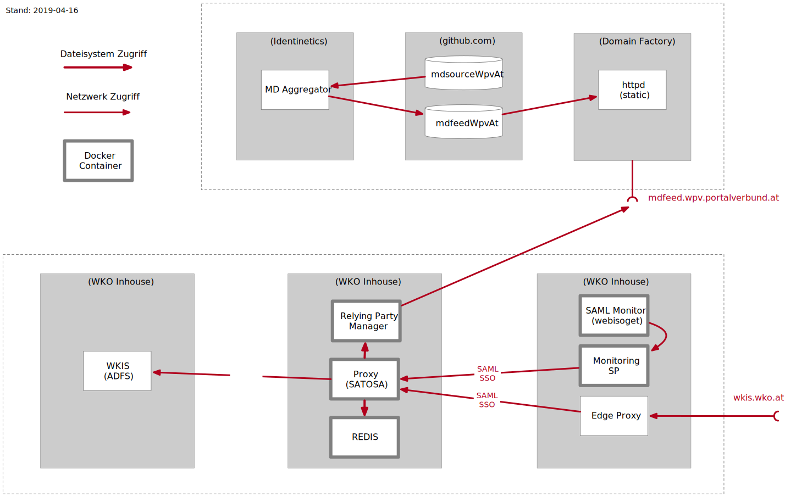

:toc:
= Deployment-Dokumentation für den WKIS/WPV-Proxy
:sectnums:
:sectnumlevels: 4

== Übersicht
=== Zweck

Der Zweck des Proxy ist die Entkopplung zwischen ADFS und der SAML Federation, wobei folgende Ziele verfolgt werden:

* Unterstützung von Einwilligung, Mehrfaktor-Authentifizierung, Profilvervollständigung und
Mitglieds- und Rollenauswahl ohne SP-seitig das WKIS-Redirect-Verfahren implementieren zu müssen.
* Vereinfachte Einbindung neuer Anwendungen
* Der jährliche Zertifikatstausch wird automtisiert zwischen Proxy und ADFS abgehandelt.

.Konzept

=== CI-Prozess und Container Schnittstellen

Der WKIS/WPV Proxy wird in Form mehrerer Docker Images deployed.
Zur Generierung der Images wird  ein CI-Prozess eingerichtet.

.CI-Prozess

{empty} +

Die Docker Images werden über Jenkins Jobs erzeugt und optional in ein Docker Repository hochgeladen.
Im jeweiligen Git Repo gibt es dafür ein Jenkinsfile.
In der Zielumgebung werden die Images vom Docker Repo geladen und ausgeführt.

Für die Container werden folgende Schnittstellen bereitgestellt:

.Container Schnittstellen

{empty} +

Die Container werden mit Docker-Compose erzeugt und gesteuert.

Die Konfiguration erfolgt über Konfigurationsdateien, die in persistenten Docker Volumes gespeichert werden.
Bestimmte Werte werden über das Environment (-> Compose-File) übergeben.

Die Konfigurationsdateien werden als Default mitgeliefert und sind für den CI-Prozess eingerichtet.
Für das Zielsystem sind sie entsprechend dieser Dokumentation anzupassen.

== Deployment
=== Systemvoraussetzungen für den Docker Host

- RH-Docker oder Docker Community Edition >= 18.09.0
- Docker Compose >= 1.18
- git

=== Komponenten und Deployment Artefakte

Die im Projekt zu betreibenden Images sind die 4 mit starkem Rand gekennzeichnenten Kästchen.

.Komponenten Übersicht

{empty} +

.Deployment Artefakte
[cols="3,1,6,3"]
|===
|Repo | Build | Beschreibung | Abhängigkeiten
|https://github.com/rhoerbe/c-wkis-proxy[c-wkis-proxy] | - | Dokumentation (zugriffsgeschützt) |
|https://github.com/identinetics/d-satosa[d-satosa]| X | Satosa Docker Image Builder | SATOSA, dcshell, d-centos7_py36_base
|https://github.com/identitypython/SATOSA[SATOSA] | - | SATOSA SAML/SAML Proxy |
|https://github.com/identinetics/d-satosa-rpmgr[d-satosa-rpmgr] | X |  Relying Party Manager (RPMGR)| -> https://github.com/identinetics/pyFF[identinetics/pyFF], https://github.com/rhoerbe/pyXMLSecurity[rhoerbe/pyXMLSecurity], d-centos7_py36_base
|https://github.com/identinetics/webisoget[webisoget] | X |  SAML-Monitor Webisoget (Docker Image Builder) |
|https://github.com/rhoerbe/c-webisoget[c-webisoget] | - | Webisoget Config Template Repo|
|https://github.com/identinetics/c-shibsp-mon[c-shibsp-mon] | X |  Monitoring SP Docker Image Builder |
|https://github.com/identinetics/d-centos7_base[d-centos7_base] | X | Base Docker Image |
|https://github.com/identinetics/d-centos7_py36_base[d-centos7_py36_base] | X | Base Docker Image | centos7_base
|https://github.com/identinetics/[dcshell] | - | Docker-compose tools |
|https://wiki.wpv.test.portalverbund.gv.at[wiki] | - | Online-Dokumentation WPV|
|WKIS (ADFS) | - | Der Proxy ist im IDP als Relying Party einzurichten und die Metadaten sind dem  Proxy zur Verfügung zu stellen.|
|Edge Proxy| - | DNS-Endpunkt für den IDP Proxy, termininiert TLS und leitet HTTP-Requests mit X-Forwarded-* Headern weiter |
|Redis Image| - | Key-Value Store für WKIS-Redirect Flow/official image | https://hub.docker.com/_/redis (`docker pull redis`)
|Redis compose config| - | Default docker-compose.yaml in diesem Repo | https://hub.docker.com/_/redis (`docker pull redis`)
|===

Installation und Konfiguration sind im README des jeweiligen Repos enthalten.

=== Staging Umgebungen

Eine klare Trennung der Staging-Zonen ist nicht immer wünschenswert,
daher muss im Einzelfall entscheiden werden wo welche Komponente eingebunden wird.
Das Standardschema ist:

[cols="<,<,^,^,^,^"]
|===
| Node |                                                            | Port | Entw.  | QS | Prod
| ext | Metadatenfeed mdfeed.test.wpv.portalverbund.at/metadata.xml |  80  |   x    | x  |
| ext | Metadatenfeed mdfeed.wpv.portalverbund.at/metadata.xml      |  80  |        | x  |
|     | wkis.qss.wko.at                                             | 443  |   x    | x  | x
|     | wkis.wko.at | 443 |  |  | x
| ext | proxy2.test.wpv.portalverbund.at | 8080 | x | x |
| 1 | rpmgr.qss.web.wk.wknet | 8081 |  | x | x
| 2 | wkiswpv.qss.wko.at | 8080 | x | x |
| 3 | rpmgr.web.wk.wknet | 9091 |  | x | x
| 3 | idp2.web.wk.wknet (Monitoring IDP)| 9092| x | x | x
| 3 | testsp.web.wk.wknet (Monitoring SP | 9093| | | x
| 4 | wkiswpv.wko.at | 9090 | |  | x
| | Anwendung mit Spieldaten Einbindungstest || x | |
| | Anwendung mit Echtdaten Einbindungstest || | x |
| | Anwendung produktiv || | | x
|===

Die VMs für QSS sind (1) webwpvqss01 (intern) und (2) webwpvqss02 (extern).

Die VMs für Prod sind (3) webwpvprod01 (intern) und (4) webwpvprod02 (extern).

Das Staging von WKIS ist wie folgt:

- dev/test/qss benötigen eine (gemeinsame) IP-Freischaltung
- test und qss haben getrennte DBs. Die Daten sind Kopien von Prod
- qss ist ähnlich wie prod, hat aber größerere Wartungsfenster
- test/qss/prod werden vom Betrieb gemanagt; dev kann ohne Betrieb von Entwicklung geändert werden

=== Versionierung

Docker Images werden mit Build-Nummern getaggt.
Die Buildnummer hat das Format Bn.m, wobei n die globale Nummer im Source Repo und m die lokale am Build-Server ist.
Sie können über diese Tags den Staging-Zonen zugeordnet werden.
Welche Source Version jeweils verwendet wird muss vom Betreiber entschieden werden.

Z.B. könnte eine Image Liste wie folgt aussehen:

    REPOSITORY            TAG                 IMAGE ID            CREATED             SIZE
    r2h2/shibsp           B8.1                62726aee1a4e        3 weeks ago         714MB
    r2h2/shibsp           latest              62726aee1a4e        3 weeks ago         714MB
    r2h2/pyff             B7.5                bd4fb3c5de90        3 weeks ago         1.1GB
    r2h2/pyff             latest              bd4fb3c5de90        3 weeks ago         1.1GB
    r2h2/shibsp           B7.7                6388f9eeb9cc        4 weeks ago         714MB
    postgres              11                  4dcf1ba7e5e2        3 months ago        312MB
    r2h2/shibsp           B5.4                ad47b59835b1        3 months ago        708MB
    r2h2/pyff             B6.1                f838e34df5a5        7 months ago        1.14GB

Die einfachste Möglichkeit die Image-Version einer Zone zuzuordnen ist den services.service.image Key im Compose-File entspreched zu setzen.

Die Buildnummer reflektiert die Änderungen von Source und Abhängigkeiten.
Siehe https://github.com/identinetics/dcshell/blob/master/docs/Buildnumbers.adoc[Buildnumbers].

Als Ergebnis eines Builds wird das Image mit den Tags :Bn.m und :latest erzeugt.
Images mit älteren Build#-Tags werden am Build-Server automatisch gelöscht.
Am Zielserver sind sie manuell zu verwalten.

Der Start eines Containers erfolgt mit dem im Compose-File konfigurierten Tag.
Die Freigabe eines Image für eine Staging-Zone erfolgt, indem der Container gelöscht und neu erstellt wird.
(docker-compose doown und up).

=== Parallelbetrieb von Containern auf der gleichen VM

QS und Prod-Instanzen können auf der gleichen VM betrieben werden.
Die unterschiedlichen Namen können z.B. wie folgt konfiguriert werden:

|===
| Datei | Variable | Wert QS | Wert Prod
| docker-compose.yaml | service | satosa-qs | satosa
| docker-compose.yaml | container_name |satosa-qs | satosa
| docker-compose.yaml | volumes | qs... | ...
| httpd.conf | Liste | 8001 |  8000
| vhost.conf | VirtualHost | *:8001 |  *.8000
|===

Hinweis: `docker-compose` schreibt die Warnung "Found orphan containers (..satosa) for this project",
wenn die Image Tags auf das gleiche Image verweisen. Diese Warnung ist zu ignorieren.
Alternativ kan man separate Projeke definieren und bei jedem Auruf von docker-compose mit --project übergeben.)

=== Build Prozess

Die Schnittstelle zwischen Entwicklung und Betrieb sind öffentliche Github Repositories,
in denen Sourcen und Jenkins Buildscripts enthalten sind.
Die Docker Images werden mit einem Jenkins Server erstellt und auf einem Docker Repo abgelegt.
Die jeweilige Build-Nummer wird im Image Tag geführt.

==== Jenkins einrichten

Der Jenkinsserver benötigt Zugriff auf alle für den Build-Prozess notwendigen Netzwerk-Ressourcen.
Dafür ist entweder eine Internetverbindung (direkt oder Proxy) erforderlich,
oder es werden Ressourcen in einem lokalen Spiegel-Repository vorgehalten und der Buildprozess entsprechend angepasst.
Ein Whitelisting der ausgehenden Verbindungen ist aufwändig,
vor allem weil sich die CentOS-Mirror-Server laufend ändern.

Die Quelle für CI-Pipeline ist das Jenkinsfile im jeweiligen Source-Repository (siehe Liste der Artefakte).
Es enthält die Konfiguration und das Jenkinsfile für den Build-Prozess.

Um einen Jenkins Job zu erstellen ist Folgendes zu beachten:

- Elementart "Pipeline"
- Die Buildparameter werden aus der Pipelinedefinition gesteuert und brauchen nicht erfasst werden
- Pipelinetyp ist "Pipeline script from SCM"
- Der Zugriff auf Github muss authentifiziert erfolgen, ein entsprechendes Credential für einen github Account ist zu erstellen
- Additional Behavior "Recursively update submodules" ist zu aktivieren
- Script Path = "Jenkinsfile"

Für alle Images, die in der Tabelle "Deployment Artefakte" mit "build" gekennzeichnet sind, ist ein Jenkins Job einzurichten.
Dafür kann der erste Job dupliziert werden; es braucht nur der Repo-URL angepasst werden.

==== Jenkins Jobs starten

Neben dem Start per GUI ist es ratsam die Jenkins-Jobs regeläßig zu starten und Fehler dem Administrator zu melden.
Ein Script für einen Cron-Job können etwa wie folgt aussehen:

[source,bash]
----
#!/bin/bash

jenkins_build() {
    ssh -p 8022 admin@localhost build -v -s $*
    if (( $? != 0)); then
        echo "add your admin alert here: jenkins build $* failed"
    fi
}

paramset2='-p nocache= -p pushimage=1'
paramset4='-p nocache="" -p start_clean=1 -p pushimage=1 -p keep_running=""'

jenkins_build intra/centos7_base
jenkins_build intra/centos7_py36_base $paramset2
jenkins_build shib/d-shibsp $paramset4
jenkins_build wpv/d-satosa $paramset4
jenkins_build wpv/d-satosa-rpmgr $paramset4
----

Die Zeile mit dem Alert ist anzupassen, z.b. um ein Mail zu senden oder einen Eintrag im Ticketing zu erstellen.

=== Docker Image am Zielsystem verfügbar machen

Das lokale Docker Repository kann am einfachsten mit der https://docs.docker.com/registry/[Docker Registry] eingerichtet werden.

Der Registry Upload ist ein optionaler Schritt in den Jenkins-Pipelines.
Um Images am Zielsystem zu laden wird das jeweilige Image manuell mit `docker pull` geholt.

Alternativ können Docker Images mit `docker image save` am jenkins-Server in ein tar Archiv kopiert
und am Zielserver mit `docker image load` geladen werden.

Als dritte Möglichkeit kann die Default Registry (Docker oder Redhat) genutzt werden,
wenn Docker Content Trust eingerichtet wird.

=== Storage

Die Container verwenden auschließlich Docker Named Volumes, die sowohl im jeweiligen Dockerfile als auch Compose-File deklariert sind.
Zu beachten ist, dass bei einer Umstellug auf einen direkten Mount ins Dateisystem die entsprechenden Verzeichnisse im Container nicht automatisch initialisert werden.

=== Netzwerkkonfiguration

Zwischen SATOSA und Internet wird ein Edge-Proxy konfiguriert, der die externe DNS-Adresse hat und TLS terminiert.
Der Edgeproxy leitet die Requests mit der XFF-Konvention an diesen Container weiter ohne die Pfade zu ändern.
Für die Dauer eines Wartungsfensters oder Systemausfalls ist die Konfiguration so zu ändern, dass sämtliche Requests auf eine statische Seite mit entsprechendem Inhalt umgeleitet werden.
Die Verbindung zum SATOSA Container erfolgt über http auf Port 8000.

Für den RPMGR-Container ist ebenfalls ein Proxy zu konfigurieren, der nur für den Betrieb die Anwendung bereitstellt.

Die Container benötigen jeweils nur eine Verbindung zum Load Balancer,
nicht aber untereinander oder  zum WKIS IDP, weil sämtliche Kommunikation über den Browser (Front Channel) verläuft.

=== Konfiguration von Container und Anwendung

Die Grundkonfiguration ist auf den Jenkins eingestellt.
Für das Zielsystem sind abweichend davon folgende Werte anzupassen.

==== SATOSA-RPMGR

- docker-compose anpassen (Netzwerk)
- /opt/etc/logrotate/logrotate.conf anpassen
- /opt/etc/satosa_rpmgr/settings_prod.py  # neues Secret erzeugen und eintragen
- Die Anwendung kann mit der vorkonfigurierten Datenbank gestartet werden.

==== SATOSA

Um die Konfigurationsänderungen nachvollziehbar zu machen, wird im Container in /opt/etc ein Git Repo erstellt,
und nach jeder Änderung ein `git add -A; git commit`ausgeführt.
Damit ist die Historie der Änderungen gut nachvollziehbar.
Zur Vorbereitung sind vHosts im Edgeproxy (Load Balancer) einzurichten

|===
|File|Parameter|Beschreibung
|docker-compose.yaml | TARGET_ENTITYID | Neue Backend WKIS entityID (der proxy übernimmt die alte entityID)
|docker-compose.yaml | port 2022, volume etc_ssh | wird am Zielystem nicht verwendet, sshd wird nicht gestartet
|docker-compose.yaml | services.<service>.image | anpassen an Repository User und Version Tag
|satosa.opt_etc:gunicorn/config.py | workers | je nach Anzahl der CPU Cores anpassen
|satosa.opt_etc:logrotate/logrotate.conf | | Intervalle, Größe etc. nach Bedarf einstellen
|satosa.opt_etc:satosa|| siehe unten
|||
|||
|||
|===

Die Proxy-Konfiguration liegt in /opt/satosa/etc.
Die Konfiguraitonsschritte sind:

* Als Startwert ist die Test-Konfiguration von install/test/proxy2 zu kopieren.
  Die Dateien keys/frontend* und keys/backend/* sind zu löschen.
* Dann sind neue selbst-signierte Schlüsselpaare zu erzeugen und als PEM in keys/ abzulegen
  (z.b. mit dem Skript config/genkey.sh in diesem Repo).
  backend*.pem und frontend.pem enthalten üblicherwise die gleichen Keys.
  WPV-seitig sind langlebige (>= 10 Jahre), selbst-signierte Zertifikate zu erstellen.
  WKIS-seitig wird entsprechend der Vorgaben der WKO Inhouse verfahren.
  Die Metadatenzertifikate für Test und Prod sind vorhanden.
* Danach sind anzupassen:
  ** proxy_conf.yaml
  ** saml2-backend.yaml
  ** saml2-frontend.yaml
* Beim ersten Start von SATOSA werde die Metadaten in metadata/ generiert.
  Sie sind zu exportieren, manuell nachzubearbeiten und dann in der Metadatenverwaltung zu registrieren.
* Logging: In der Voreinstellung loggt SATOSA sowohl auf die Konsole als auch nach /var/log/satosa.
  Für den laufenden Betrieb reicht ein Output Stream.
  Um den Logoutput auf stdout/stderr zu leiten, ist /opt/etc/gunicorn/config.py entpsrechend anzupassen.
==== RPMGR

==== Webisoget

==== Monitoring SP

=== Setup Script für die Target VM

Das Deployment erfolgt in folgenden Schritten:

   # 2. Dieses Repo am Zielsystem auschecken wie oben beschrieben
   cd /opt
   git clone github.com/rhoerbe/c-wkis-proxy
   git submodule update --init

   # 3. Container + persistente Volumes erzeugen
   cp docker-compose.yaml.default docker-compose.yaml

== Betrieb
=== Start und Stop

Die Container werden über docker-compose parametrisiert und gesteuert.

.Befehle
|===
| Operation| Befehl: docker-compose ...
| Container erzeugen und im Hintergrund starten | up -d
| Container stoppen und löschen | down
| Terminal-Fenster im Container öffnen | exec <servce> bash
|===

=== Monitoring

Das einfache Monitoring erfolgt mit einem HTTP-Request auf den Proxy mit dem Pfad sso/redirect.
Das erwartete Resultat ist ein HTTP 4xx Fehler.

Das ausführliche Monitoring führt eine Anmeldung durch.
Dazu wird Webisoget konfiguriert. (-> separate Dokumentation)

=== Backup/Recovery

Die Konfiguration wird in den Docker Volumes des jeweiligen Containers persistiert.
Werden diese Volumes gesichert, kann das System durch ein Restore der Volumes und dem Start von docker-compose wieder hergestellt werden.

Die Container sind unter /var/lib/docker/volumes abgelegt. 
Die Namenskonvention für Docker Volumes ist <container>.uc_pfad.
uc_pfad ider das gemappte Directory, vobei / durch _ ersetzt wird.
Z.B. satosa-pr.opt_satosa_etc und satosa-pr.var_log

Änderungen sind selten bei den Konfigurationsdaten in /opt/c-wkis-proxy zu erwarten.

Ansonsten wird ein VM-Snapshot in diesem Fall die einfachste Backuzp-Strategie sein.

=== Logging

Die Archivierung der Logfiles wird außerhalb der Container gemacht.

Für die Rotation der Logfiles wird im jeweiligen Container `/opt/bin/rotate_logs.sh` aufgerufen.
Die Logrotate-Konfiguration kann über /opt/etc/logrotate/logrotate.conf angepasst werden.

=== Security Considerations

Der Betrieb ist für Aktualisierung und Vulnerability Scanning verantwortlich.